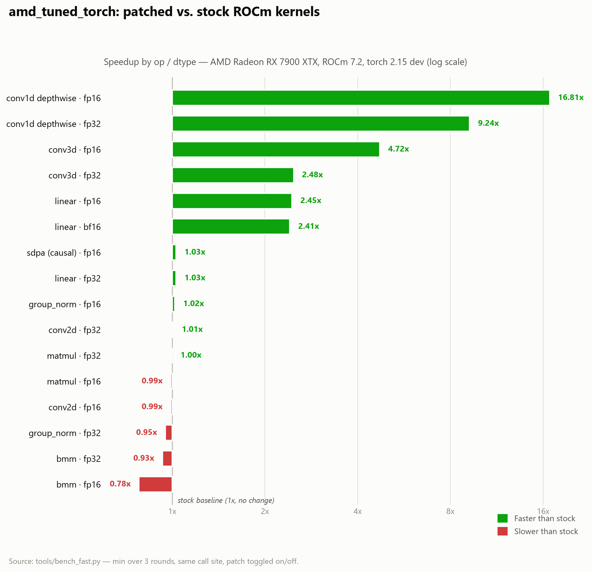

# I Got Tired of Guessing Which AMD Kernel Was Fastest — So I Made PyTorch Guess For Me

### `rocm-kernel-select`: an open-source PyTorch extension that benchmarks your ops on first call and auto-picks the fastest ROCm backend, every time.

If you've trained or run inference on an AMD GPU with ROCm, you've probably run into this: there isn't just *one* way to run a matmul, a conv3d, or a group norm. There are several — stock ROCm (rocBLAS, hipBLASLt, MIOpen), [aiter](https://github.com/ROCm/aiter), [Composable Kernel](https://github.com/ROCm/composable_kernel), the ROCm fork of [TransformerEngine](https://github.com/ROCm/TransformerEngine), and sometimes hand-rolled HIP kernels. Each one is faster than the others for *some* shape, dtype, and op combination — and slower for others.

Nobody tells you which one to pick. You either hardcode a backend and eat the losses on the shapes it's bad at, or you spend your afternoons manually benchmarking every op in your model. I did that once. I'm not doing it again.

So I built `rocm-kernel-select` (package name `amd_tuned_torch`) — a small PyTorch extension that does the guessing for you, automatically, at runtime.

## The idea: benchmark once, cache forever

The core trick is embarrassingly simple, which is why it works:

1. `amd_tuned_torch` monkeypatches a handful of `torch` / `torch.nn.functional` ops.
2. The **first time** it sees a call with a given shape and dtype, it benchmarks every available kernel candidate for that op — including stock PyTorch itself.
3. It caches the winner, keyed by shape.
4. Every subsequent call with that shape dispatches straight to the cached winner — zero benchmarking overhead after the first hit.

If nothing beats stock for a given shape, it falls back to stock. So the worst case is "same as vanilla PyTorch plus one extra benchmark call the first time a shape appears." There's no scenario where this makes your model slower in steady state.

```python
import amd_tuned_torch   # patches torch / torch.nn.functional on import

amd_tuned_torch.disable()  # opt out at runtime
amd_tuned_torch.enable()   # opt back in
```

Set `AMD_TUNED_TORCH_AUTOPATCH=0` if you want to import the package without it touching anything.

## What's currently patched

- `F.linear`, `torch.matmul`, `torch.bmm`
- `F.conv2d`, `F.conv3d`
- `F.group_norm`
- `F.scaled_dot_product_attention`, `F.rms_norm`, `F.gelu`, `F.silu` (optional, TransformerEngine-backed)

Everything else is left untouched and runs on stock PyTorch — no surprises, no silent behavior changes outside this list.

## Does it actually help? Yes — dramatically, in the right spots



Numbers below are from `tools/bench_fast.py` on an AMD Radeon RX 7900 XTX (ROCm 7.2.53211, torch 2.15.0.dev20260820+rocm7.2), min over 3 rounds, toggling the patch on and off at the same call site:

| Op | Shape | Dtype | Stock (ms) | Patched (ms) | Speedup |
|---|---|---|---|---|---|
| linear | 2048×2048 @ 2048×2048ᵀ | float16 | 0.679 | 0.277 | **2.45x** |
| linear | 2048×2048 @ 2048×2048ᵀ | bfloat16 | 0.665 | 0.276 | **2.41x** |
| conv3d | N=1, C=64→64, 16×32×32, k=3 | float16 | 0.443 | 0.094 | **4.72x** |
| conv1d (depthwise) | N=8, C=256, L=2048, k=3, groups=256 | float16 | 0.863 | 0.051 | **16.81x** |
| matmul / bmm / conv2d / group_norm | various | fp16/fp32 | — | — | ~1.0x (no regression) |

Notice the pattern: some ops (fp16 linear, depthwise conv1d, conv3d) get *huge* wins because stock ROCm kernels aren't well-tuned for those shapes yet. Others (plain matmul, bmm, conv2d) are already near-optimal on stock, so the patch correctly detects that and leaves them alone — no regression, because it always benchmarks against stock as one of the candidates.

## The conv3d sweep tells the real story

I also ran a 38-case parameter sweep across kernel size, spatial extent, channel count, batch size, anisotropic shapes, stride/padding, dtype, and asymmetric channels:

| | |
|---|---|
| Cases timed | 38 (0 failed) |
| Winner breakdown | Composable Kernel: 30, FFT-conv: 3, native HIP: 3, stock: 2 |
| Faster than stock | 27 |
| Slower than stock | 6 |
| Best speedup | **11.65x** (large kernel, k=15, fp16) |
| Worst speedup | 0.52x (small shape, fp32, dispatch overhead dominates) |

Composable Kernel wins most cases, especially large kernels and channel-heavy shapes — which lines up with what CK is actually designed for. Stock wins the handful of cases where the tensors are so small that any dispatch overhead outweighs a faster kernel — and because the selector caches per-shape, that only costs one extra benchmark call the first time that shape shows up.

That "not always faster" result is actually the whole point of the project. Anyone can hardcode a fast path for the shapes in their own benchmark script. Handling the shapes where it *doesn't* help — without regressing them — is the harder and more useful problem.

## Getting it running

Linux only (ROCm is Linux-first), and you need a ROCm build of PyTorch for your GPU:

```bash
pip install -e . --no-build-isolation
```

Optional dependencies (`aiter`, Composable Kernel, TransformerEngine) unlock more candidate backends per op — the more candidates available, the better the dispatcher's choices get.

Tests run without a GPU:

```bash
python -m pytest tests
```

They cover dispatch logic — eligibility checks and fallback behavior — with the native extension, aiter, and TransformerEngine mocked out.

## Why this matters beyond one repo

AMD's ROCm ecosystem is maturing fast, but it's still fragmented: different teams ship different kernel libraries, each optimized for different shape regimes, and none of them dominate across the board. That's a very different situation from CUDA, where cuBLAS/cuDNN have had over a decade to become the default answer for almost everything.

Until ROCm consolidates the way CUDA did, the pragmatic answer isn't "pick a library and hope" — it's "measure at runtime and let the fastest option win, per shape, automatically." That's what this project does, and it costs you nothing beyond one extra benchmark call per unique shape.

It's MIT-licensed and open source. If you're running PyTorch on AMD hardware and want free speedups without rewriting your model code, it's worth trying.

---

*If this is useful to you, contributions are welcome — especially more benchmarked shapes, additional patched ops, and testing on other AMD GPU generations.*
